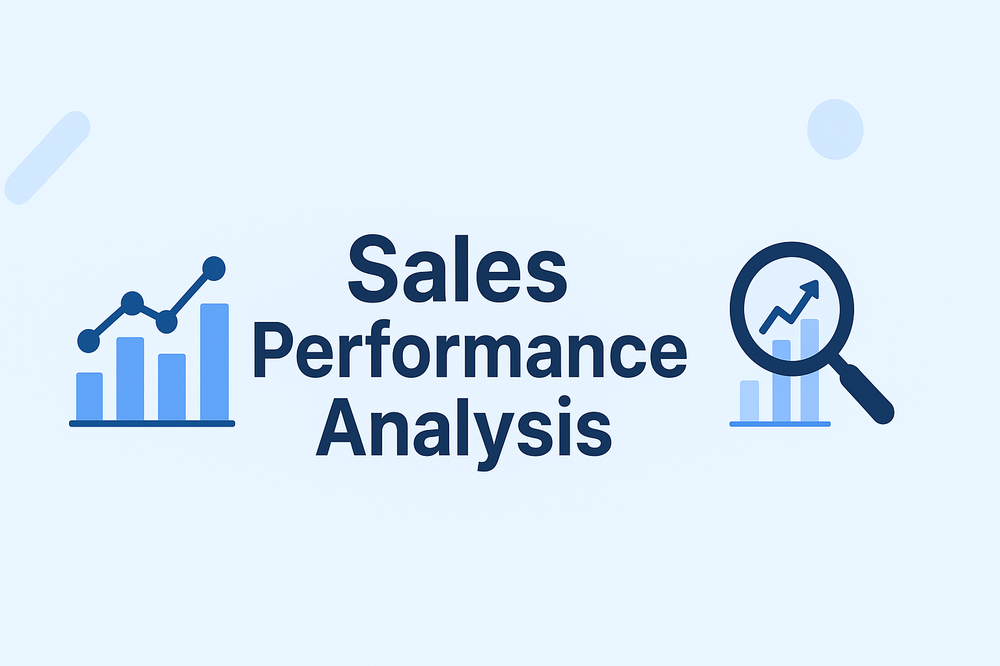
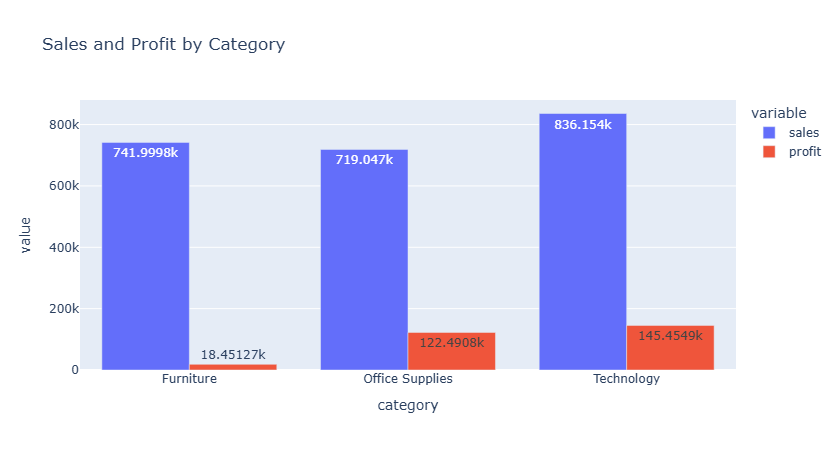
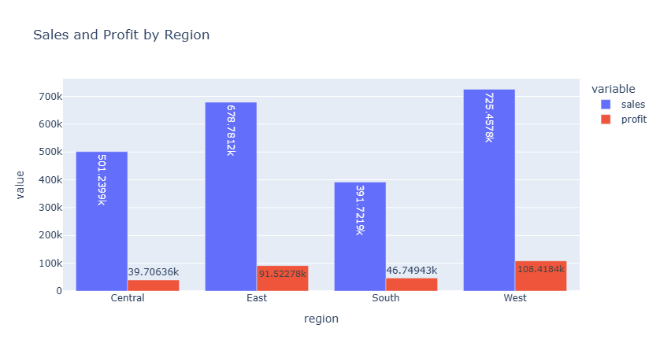
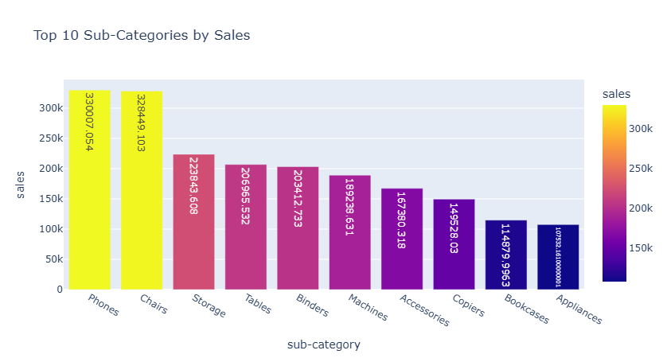
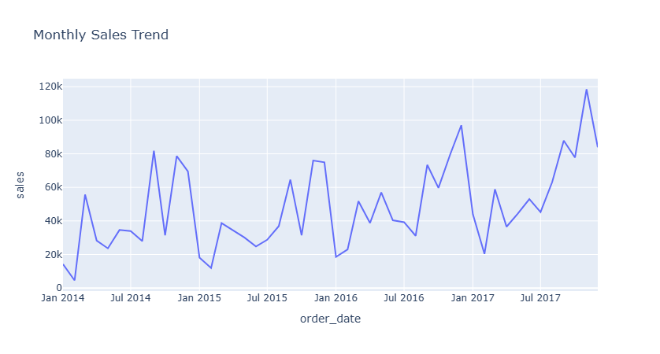

# 📊 Sales Performance Analysis | Superstore Dataset


---

## 🔹 Project Overview
This project analyzes historical sales data from a global superstore to uncover trends, identify top-performing products and regions, and provide actionable business recommendations. The goal is to help management optimize sales, improve profitability, and make data-driven decisions.

**Tools Used:** Python (Pandas, Matplotlib, Plotly), Git/GitHub, VS Code

---

## 🎯 Business Objective
- Identify top-selling categories, sub-categories, and regions  
- Track monthly sales trends to monitor growth  
- Provide actionable recommendations to increase revenue and profitability

---

## 📂 Dataset Details
- **Source:** [Kaggle Superstore Dataset](https://www.kaggle.com/datasets/vivek468/superstore-dataset-final)  
- **Rows:** ~9,900  
- **Columns:** Order ID, Order Date, Category, Sub-Category, Sales, Profit, Quantity, Discount, Region, Segment  
- **Data Quality Notes:** Duplicates removed, missing values checked, column names standardized  

---

## 📈 Key Metrics & Insights

| Metric | Value |
|--------|-------|
| Total Sales | $2,297,201 |
| Total Profit | $286,397 |
| Total Orders | 5,000+ |
| Average Discount | 12% |
| Top Category | Technology ($836,154) |
| Top Region | West ($725,458) |
| Trend | Upward monthly sales growth |

**Observations:**  
- Technology drives the highest revenue; Furniture and Office Supplies follow  
- West region is the most profitable; Central region shows growth potential  
- Phones, Chairs, and Laptops are top-selling sub-categories  
- Monthly sales show consistent upward trend

---

## 📊 Visual Insights (Static Images)

### 1️⃣ Sales & Profit by Category


### 2️⃣ Sales & Profit by Region


### 3️⃣ Top 10 Sub-Categories by Sales


### 4️⃣ Monthly Sales Trend


> 💡 Note: For interactive charts, open `notebooks/sales_eda.ipynb` where all charts are fully interactive with Plotly.

---

## 💡 Business Recommendations
1. **Focus on Technology Products:** Increase marketing and optimize inventory for Phones, Laptops, and Accessories  
2. **Optimize Western Region Strategy:** Expand promotions and improve supply chain efficiency  
3. **Monitor Growth Trends:** Use monthly sales trends to plan seasonal campaigns  
4. **Address Low-Performing Categories:** Investigate Furniture & Office Supplies to improve margins  

---

## 🔮 Future Enhancements
- Build a **full interactive dashboard** (Plotly Dash / Power BI / Tableau)  
- Conduct **customer segmentation analysis** for targeted marketing  
- Implement **sales forecasting** using time-series models  
- Optimize profit margins and provide product recommendations  

---

## 🛠️ How to Run This Project
1. Clone the repository:
```bash
git clone https://github.com/Aishwaryajohn97/sales-performance.git

2. Install Dependencies:

pip install pandas matplotlib plotly nbformat

3.Open the Notebook:

jupyter notebook notebooks/sales_eda.ipynb

4. Run cells to view KPIs, charts, and insights interactively.


